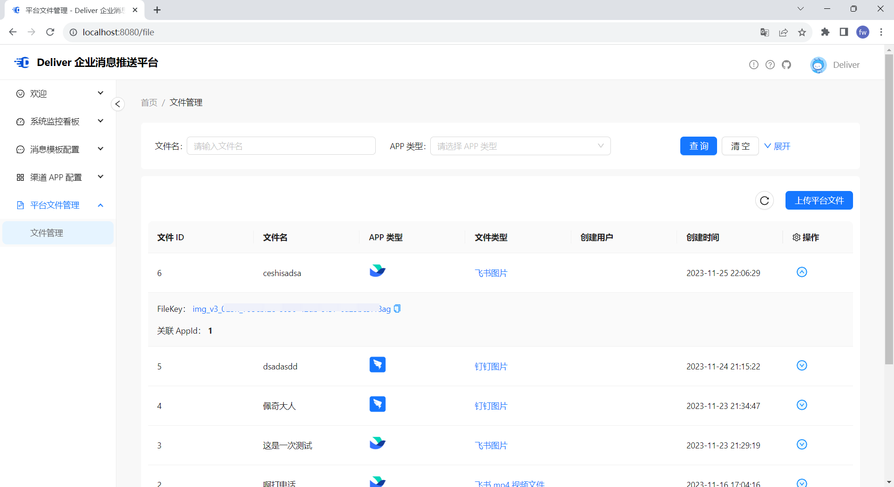

<h1 style="margin: 30px 0 30px; font-weight: bold;">Deliver</h1>

<h4 align="center">一个轻量级企业消息推送平台，旨在提供企业内部沟通和协作的便捷解决方案！</h4>

<a href="https://oszero.cn" target="_blank">官方网站</a> |
<a href="https://gitee.com/OS-Zero/deliver/issues" target="_blank">需求收集</a> |
<a href="https://gitee.com/OS-Zero/deliver/issues" target="_blank">问题反馈</a>

<a href='https://gitee.com/OS-Zero/deliver/stargazers'></img></a>
<a href='https://gitee.com/OS-Zero/deliver/members'></img></a>

--------------------------

## 项目介绍

**Deliver**
消息推送平台，企业内部的消息推送系统，旨在提供企业内部沟通和协作的便捷解决方案。它以轻量级部署、简单易用、支持多种通信渠道为特点，为企业提供高效的消息传递和通知功能。我们相信高效的内部沟通对企业的成功至关重要，Deliver
将成为您实现这一目标的得力助手。无论您需要电话通知、短信提醒、邮件通告，还是钉钉、企业微信和飞书的消息推送，Deliver 都能满足您的需求。

## 系统架构

## 消息发送时序图

## 核心特性

- 支持阿里云、腾讯云、华为云电话服务；
- 支持阿里云、腾讯云、华为云短信服务；
- 支持邮件消息推送功能；
- 支持钉钉文本、图片、语音、文件、链接、OA、markdown、卡片、机器人等消息类型推送；
- 支持企业微信文本、图片、语音、视频、文件、文本卡片、图文、markdown 等消息类型推送；
- 支持飞书文本、富文本、图片、消息卡片、分享群名片、语音、视频、文件等消息类型推送；
- 支持钉钉、企业微信、飞书，消息文件上传功能，统一进行文件管理，便于发送多媒体消息；
- 支持圈定人群定时单次、定时循环（Cron表达式）消息推送功能；
- 轻量级部署，仅依赖 MySQL、MQ、Redis（最轻量级只需依赖 MySQL、Redis）；
- 支持多种 MQ，包括 RabbitMQ、RocketMQ、Redis Stream、Disruptor 等，后续支持 Apache Kafka、 Apache Pulsar 等；
- 管理端前端支持 Vue3、React 两种版本可供选择，UI 设计采用 Ant Design，界面美观简洁。

## 最佳实践

- Deliver 消息推送平台，推崇轻量级部署方式；
- 消息推送服务端并没有设置鉴权功能，推荐采用 API 网关（Apache ShenYu、阿里云网关等）进行鉴权拦截；
- 高可用、高性能部署方案，采用服务端集群（缓存为分布式 Redis 缓存）、MQ 集群、网关负载均衡等策略。

## 后台管理描述
| 顶部菜单 | 功能描述|
|:-----|:---------|
|分组管理|对主体功能的数据隔离|
|系统管理|对系统进行设置|

分组下功能：

| 一级菜单   | 二级菜单   | 功能描述            |
|:-------|:-------|:----------------|
| 模板配置   | 消息模板配置 | 消息推送模板的 CRUD    |
| 应用配置   | 渠道应用配置 | 各渠道应用相关配置 CRUD  |
| 文件管理   | 平台文件管理 | 钉钉、企微、飞书多媒体文件管理 |
| 群发任务   | 群发任务配置 |群发任务的 CRUD|
| 群发任务 | 人群模板配置 |人群模板的 CRUD|

## 在线演示

- 管理端：Vue: oszero.cn:6060、React: oszero.cn:7070

## 项目部分截图
### 首页
--- 

### 数据看板
---

### 消息模版
---

### APP 配置
---

### 文件管理
---

## 技术栈

- 后端：Spring Boot、Mybatis-Plus
- 前端：Vue.js、React.js、Ant Design
- 依赖软件：MySQL、Redis、MQ

## 交流群

<a href="https://os-zero.gitee.io/deliver-website/pages/3a3a11/" target="_blank">点击加入群聊</a>

## 参与贡献

我们强烈欢迎有兴趣的开发者参与到项目建设中来，同时欢迎大家对项目提出宝贵建议和功能需求，项目正在积极开发，欢迎 PR 👏。
推荐阅读：<a href="https://os-zero.gitee.io/deliver-website/pages/2a2a11/#%E8%B4%A1%E7%8C%AE%E6%8C%87%E5%8D%97" target="_blank">贡献指南</a>

## 接入登记

如果您和您的公司或组织使用了 Deliver，非常感谢您的支持与信任，请 [在此](https://gitee.com/OS-Zero/deliver/issues/I8IPY3) 进行接入登记，您的回复将成为维护者、社区用户和观望者的信心来源。感谢支持 💖
> 登记信息仅用于推广本产品～ 
