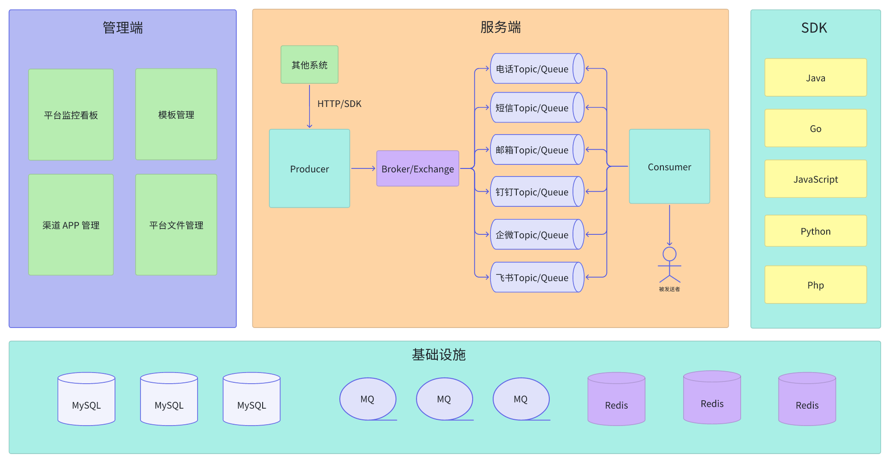

<h1 style="margin: 30px 0 30px; font-weight: bold;">Deliver</h1>

<h4 align="center">一个轻量级企业消息推送平台，旨在提供企业内部沟通和协作的便捷解决方案！</h4>

[官方网站](https://os-zero.gitee.io/website/) | [需求收集](https://gitee.com/OS-Zero/deliver/issues) | [问题反馈](https://gitee.com/OS-Zero/deliver/issues)

--------------------------

## 项目介绍

**Deliver** 消息推送平台，企业内部的消息推送系统，旨在提供企业内部沟通和协作的便捷解决方案。它以轻量级部署、简单易用、支持多种通信渠道为特点，为企业提供高效的消息传递和通知功能。我们相信高效的内部沟通对企业的成功至关重要，Deliver 将成为您实现这一目标的得力助手。无论您需要电话通知、短信提醒、邮件通告，还是钉钉、企业微信和飞书的消息推送，Deliver 都能满足您的需求。

## 系统架构

## 核心特性

- 支持阿里云、腾讯云、华为云电话服务。
- 支持阿里云、腾讯云、华为云短信服务。
- 支持邮件消息推送功能。
- 支持钉钉文本、图片、语音、文件、链接、OA、markdown、卡片、机器人等消息推送。
- 支持企业微信文本、图片、语音、视频、文件、文本卡片、图文、markdown等消息推送。
- 支持飞书文本、富文本、图片、消息卡片、分享群名片、语音、视频、文件等消息推送。
- 支持钉钉、企业微信、飞书，消息文件上传功能，统一进行文件管理。
- 轻量级部署，仅依赖 MySQL、MQ、Redis（最轻量级只需依赖 MySQL、Redis）。
- 支持多种  MQ，包括 RabbitMQ、RocketMQ、Kafka 等，后续支持 Apache Pulsar 等。
- 支持各语言 SDK，轻松接入系统（Java、Go、Python、Cpp 等）。  
- 管理端前端支持 Vue3、React 两种版本可供选择，UI 设计采用 Ant-Design Pro，界面美观。
- 支持 jar 包 shell、docker 镜像等多种部署方式。

## 最佳实践
- Deliver 消息推送平台，推崇轻量级部署方式，消息链路追踪已实现日志打印输出到具体文件功能，可根据自身情况搭建日志采集分析服务。
- 消息推送服务端并没有设置鉴权功能，推荐采用 API 网关（Apache ShenYu、阿里云网关等）进行鉴权拦截（相关接入文档已写）。
- 高可用、高性能部署方案，采用服务端集群（缓存为分布式 Redis 缓存）、MQ 集群、网关负载均衡等策略。

## 后台管理描述
| 一级菜单 | 二级菜单      | 功能描述                       |
|:-----|:---------|:---------------------------|
|系统监控看板|平台数据看板|平台内部的数据可视化展示|
|消息模板配置|消息模板|消息推送模板的 CRUD|
|渠道APP配置|APP 配置|各渠道 APP 相关配置 CRUD|
|平台文件管理|文件管理|钉钉、企微、飞书文件管理|
|系统设置|设置|平台的通用设置|

## 在线演示

- 管理端：敬请期待

## 项目截图

## 技术栈
- 后端：Spring Boot、Mybatis-Plus、Spring Cache
- 前端：Vue.js、React.js、Ant Design Pro
- 依赖软件：MySQL、Redis、MQ、Docker

## 交流群
 [点击加入群聊](https://os-zero.gitee.io/website/community/communicate.html)

## 参与贡献
我们强烈欢迎有兴趣的开发者参与到项目建设中来，同时欢迎大家对项目提出宝贵建议和功能需求，项目正在积极开发，欢迎 PR 👏。
推荐阅读：[贡献指南](https://os-zero.gitee.io/website/community/contributorGuide.html)

## 接入登记

如果您和您的公司或组织使用了 Deliver，非常感谢您的支持与信任，请在此进行登记，您的回复将成为维护者、社区用户和观望者的信心来源。感谢支持 💖
>登记信息仅用于推广本产品～ 
